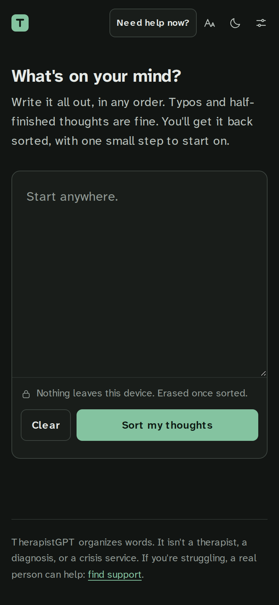
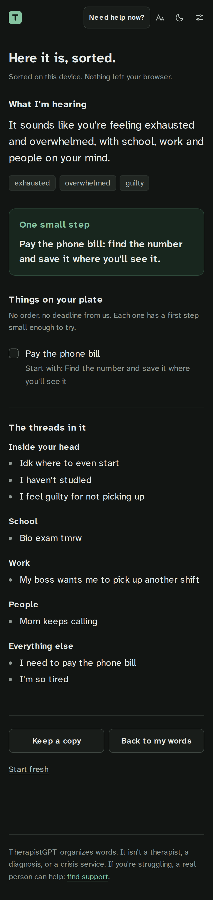
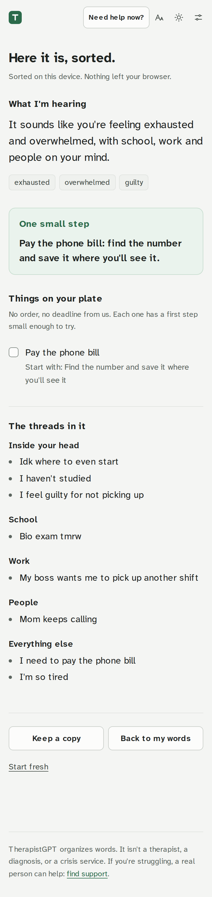

# TherapistGPT

A small language model that takes a messy brain dump and lays it back out so it is easier to look at.

When depression is loud, thoughts pile up into one long paragraph: worries, chores, guilt and memories all tangled together. You paste that paragraph in, and TherapistGPT hands the same thoughts back in a few calm pieces:

- **What I'm hearing**: one or two sentences that name what's going on without judging it
- **Feelings** you named or implied
- **The threads**: related thoughts grouped together (school, people, rest, money...)
- **Things on your plate**, each with a first step small enough to try right now
- **A kinder way to hear it**: harsh things you said about yourself, answered honestly and gently
- **One small step** for the next ten minutes

If the text mentions suicide or self-harm, a support card with 988, the Crisis Text Line and international helplines appears first. That check is a plain keyword match that runs before any model, so it never depends on the model getting it right.

**Try it:** [garyzhang1006.github.io/TherapistGPT](https://garyzhang1006.github.io/TherapistGPT/)

<p>
  
  
  
</p>

The [desktop layout](docs/screenshots/results-desktop.png) puts the threads in two columns. `.github/workflows/screenshots.yml` retakes these from the live site.

TherapistGPT organizes words. It is not a therapist, a diagnosis, or a crisis service.

## How it works

The project has two halves.

`web/` is the app. It's plain HTML, CSS and JavaScript with no build step and no dependencies. Out of the box it sorts text with a rule-based organizer that runs entirely in the browser, so nothing typed ever leaves the device. Once you've trained the model, you paste its address into **Settings** and the app sends text to your model instead, falling back to the on-device organizer if the model is slow or down.

`compute/` builds the model. A teacher model (Claude) writes a couple of thousand realistic brain dumps together with their organized versions, a validator throws out anything malformed or mislabeled, and a LoRA fine-tune teaches [Qwen2.5-1.5B-Instruct](https://huggingface.co/Qwen/Qwen2.5-1.5B-Instruct) to produce the same JSON. Everything there is meant to run remotely; the Kaggle notebook runs the whole pipeline on a free T4. See [`compute/README.md`](compute/README.md).

Both halves share one output contract, defined in [`compute/therapistgpt/schema.py`](compute/therapistgpt/schema.py). The web tests check the on-device organizer against the same limits, and a test fails if the crisis phrase lists in Python and JavaScript ever drift apart.

## Design choices for people who are struggling

- A dusk palette with no pure white and no alarm red, and a light "morning" theme for people who find dark screens heavy. Both themes meet WCAG AA contrast.
- One text box and one button. No accounts, streaks, scores, word counts or timers.
- The draft is kept on the device as you type, so closing the tab doesn't lose it, and it's erased once sorted. Clearing it by hand can be undone.
- A larger-text toggle, full keyboard use, and no motion at all when the system asks for reduced motion.
- Copy that validates first and never lectures. Reframes avoid diagnosing ("that's depression") and avoid false cheer.
- The moon in the corner breathes at six breaths a minute, the pace of slow, calming breathing.

## In a crisis

A **Need help now?** link at the top of every screen opens call and text links for 988, the Crisis Text Line, and findahelpline.com for other countries. It is a plain link, so it still shows those numbers if the page's script fails to load. When a brain dump mentions suicide or self-harm, the results open with that card, the rest of the sort waits behind a closed "The rest of what you wrote" section, and no crisis sentence is handed back as a to-do or a thread.

The app will not talk with you, contact anyone, or judge how much danger someone is in. Its crisis check is a list of phrases, and phrasings it has not seen get past it: on two sets of brain dumps written after the rules and kept from them, it caught 6 of 11 and then 6 of 12 crisis dumps on the first run. Every miss became a new rule, but the next unseen wording can still slip through. If you are thinking about ending your life, call or text 988 in the US or Canada, or your local emergency number. Don't count on this app to notice.

## Privacy

With the built-in organizer, nothing you type leaves the browser. The fonts and icons come from this site, and the page sends no requests anywhere once it has loaded. Your draft sits in the browser's local storage while you write and is deleted the moment you sort it. Ticked to-dos live in session storage, which the browser clears when the tab closes, and the theme and text-size choices stay in local storage. There are no accounts, analytics or cookies. If you add a model address in **Settings**, your text goes to that server and nowhere else.

## Run it locally

```bash
cd web
npm start        # serves on http://localhost:8000 (python3 -m http.server)
npm test         # node's built-in test runner, no installs
```

The site can be installed to a phone's home screen and opens with no signal: `web/sw.js` keeps a copy of each release on the device. Its cache is keyed to the `?v=` number, so a release bumps that number in `index.html`, every import, and `VERSION` in `sw.js` together (`npm test` checks they match). The PNG icons are drawn only by the Pages deploy, so on localhost the offline copy fails to install and edits show up on reload as before.

## Train the model

Open `compute/kaggle_train.ipynb` on Kaggle, add your `ANTHROPIC_API_KEY` (and `HF_TOKEN` to publish), and run it top to bottom. [`compute/README.md`](compute/README.md) covers each script, costs, evaluation, and deploying the API to a Hugging Face Space.

## Project layout

```
web/                 static app (GitHub Pages serves this folder)
  js/organizer.js    on-device organizer
  js/safety.js       crisis phrase detection
  js/engine.js       picks on-device or your model, with fallback
  js/render.js       results view
  sw.js              offline copy of each release
  tests/             node --test suites
compute/             everything that needs a GPU or an API key
  therapistgpt/      shared schema, prompt, safety floor, inference
  kaggle_train.ipynb end-to-end training run
  space/             Hugging Face Space for serving
```

## License

MIT. See [LICENSE](LICENSE).
